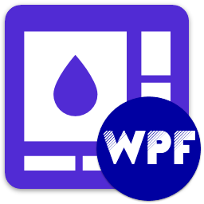

<div id="top"></div>

<!-- PROJECT INFO -->
<br />
<div align="center">
  <a href="https://github.com/sandre58/MyNetWpf">
    
  </a>

<h1 align="center">My .NET WPF</h1>

[![Downloads][downloads-shield]][downloads-url]
[![Forks][forks-shield]][forks-url]
[![Stargazers][stars-shield]][stars-url]
[![Issues][issues-shield]][issues-url]
[![MIT License][license-shield]][license-url]

  <p align="center">
    <br />
    Welcome to My .NET WPF repository! This repository houses a collection of .NET tools designed to enhance the development of WPF applications by providing a rich set of controls and styles. Whether you're building a desktop application or a sophisticated user interface, these tools offer a variety of pre-designed UI components and customizable styles to streamline your development process.
    <br />
    Supporting only .NET 8.0
  </p>

[![Language][language-shield]][language-url]
[![Framework][framework-shield]][framework-url]
[![Version][version-shield]][version-url]
[![Build][build-shield]][build-url]

</div>

## Getting Started

To start using My .NET WPF in your project, follow these steps:

1. Install the library via NuGet Package Manager:
   ```bash
   dotnet add package MyNet.Wpf

## What's included ?

- **Rich Control Set**: Access a wide range of controls including buttons, text boxes, sliders, data grids, and more, to cover common UI scenarios and functionalities in WPF applications.
- **Stylish Design Templates**: Choose from a selection of professionally crafted design templates and styles to achieve consistent and aesthetically pleasing UI designs across the application.
- **Customization Options**: Customize control appearance, behavior, and layout using built-in properties, templates, and styles to match the application's branding and design specifications.
- **Theme Support**: Support multiple themes and color schemes to enable users to personalize the application's appearance and adapt it to their preferences.
- **Responsive Layouts**: Implement responsive and adaptive layouts using flexible control templates and panels to ensure optimal viewing experiences across different screen sizes and resolutions.
- **Data Visualization Controls**: Integrate data visualization controls such as charts, graphs, and diagrams to present complex data in a visually compelling and interactive manner.
- **Accessibility Features**: Ensure accessibility compliance by incorporating features such as keyboard navigation, screen reader support, and high-contrast modes for users with disabilities.
- **Documentation and Support**: Benefit from comprehensive documentation, tutorials, and examples to guide usage and customization of the controls and styles library, supplemented by responsive support channels for assistance and troubleshooting.

## License

Copyright © Stéphane ANDRE.

My .NET WPF is provided as-is under the MIT license. For more information see [LICENSE](./LICENSE).

<!-- MARKDOWN LINKS & IMAGES -->
<!-- https://www.markdownguide.org/basic-syntax/#reference-style-links -->
[language-shield]: https://img.shields.io/github/languages/top/sandre58/MyNetWpf
[language-url]: https://github.com/sandre58/MyNetWpf
[forks-shield]: https://img.shields.io/github/forks/sandre58/MyNetWpf?style=for-the-badge
[forks-url]: https://github.com/sandre58/MyNetWpf/network/members
[stars-shield]: https://img.shields.io/github/stars/sandre58/MyNetWpf?style=for-the-badge
[stars-url]: https://github.com/sandre58/MyNetWpf/stargazers
[issues-shield]: https://img.shields.io/github/issues/sandre58/MyNetWpf?style=for-the-badge
[issues-url]: https://github.com/sandre58/MyNetWpf/issues
[license-shield]: https://img.shields.io/github/license/sandre58/MyNetWpf?style=for-the-badge
[license-url]: https://github.com/sandre58/MyNetWpf/blob/main/LICENSE
[build-shield]: https://img.shields.io/github/actions/workflow/status/sandre58/MyNetWpf/ci.yml?logo=github&label=CI
[build-url]: https://github.com/sandre58/MyNetWpf/actions
[downloads-shield]: https://img.shields.io/github/downloads/sandre58/MyNetWpf/total?style=for-the-badge
[downloads-url]: https://github.com/sandre58/MyNetWpf/releases
[framework-shield]: https://img.shields.io/badge/.NET-8.0-purple
[framework-url]: https://github.com/sandre58/MyNetWpf/tree/main/src/MyNet.Wpf
[version-shield]: https://img.shields.io/nuget/v/MyNet.Wpf
[version-url]: https://www.nuget.org/packages/MyNet.Wpf